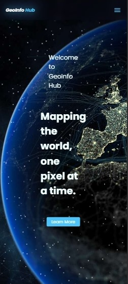
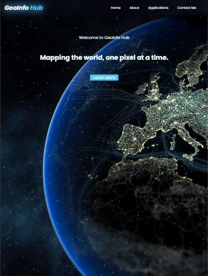
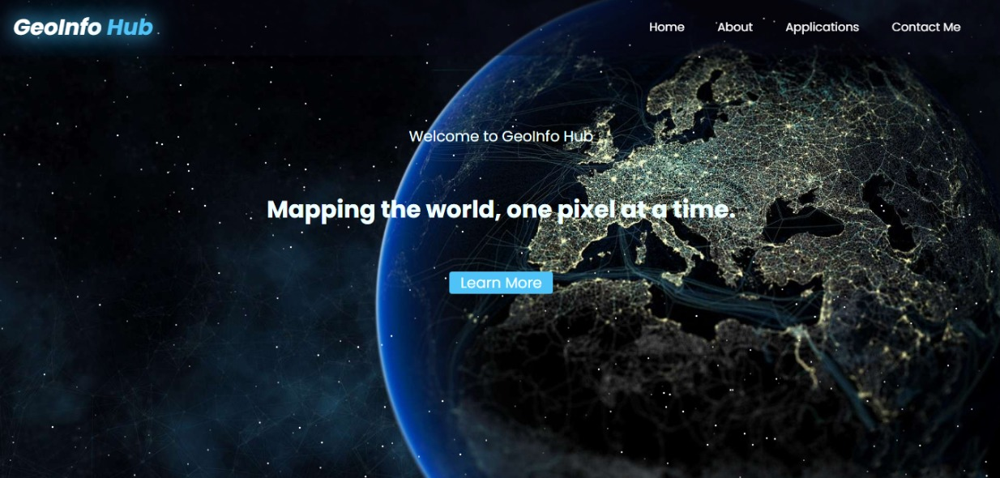

# 🌍 GeoInfo Hub

**GeoInfo Hub** is a sleek, educational website designed to introduce users to the world of Geographic Information Systems (GIS) and Remote Sensing (RS). It highlights real-world applications, explains core concepts, and provides a contact form for engagement—all wrapped in a responsive, visually engaging layout.

---

## 📸 Mockup Previews

| Device | Preview |
|--------|---------|
| **Mobile View** |  |
| **Tablet View** |  |
| **Desktop View** |  |

---

## 🔗 Live Site

Visit the hosted site here: [GeoInfo Hub Live](https://geoinfohub.netlify.app/)

---

## 📁 Project Structure
plp-webtechnologies-classroom-july2025-july-2025-final-project-and-deployment-Final-Project-and-Depl/
├── index.html
├── html/
│   ├── About.html
│   ├── Applications.html
│   └── Contact_Me.html
├── css/
│   ├── index.css
│   ├── About.css
│   ├── Applications.css
│   └── Contact_Me.css
├── js/
│   ├── index.js
│   ├── About.js
│   ├── Applications.js
│   └── Contact_Me.js
├── assets/
│   ├── boy_girl_thinking.png
│   ├── communication_illustrations_prime.png
│   └── [other images...]
└── README.md
└── DOCUMENTATION.md

---

## 🏠 Home Page (`index.html`)

- Welcomes users with a bold slogan: _“Mapping the world, one pixel at a time.”_
- Features a clean navbar with responsive sidebar toggle.
- Includes a call-to-action button linking to the About page.
- Background animation via `star-container` adds visual depth.

---

## 📖 About Page (`About.html`)

- Introduces GIS and RS with engaging illustrations.
- Explains GIS as a tool for spatial data analysis and its relevance in daily life.
- Defines Remote Sensing and its role in perceiving distant phenomena.
- Details the **six core components of GIS**:
  - Hardware
  - Software
  - Data
  - People
  - Standards
  - Network

Each component is explained with clarity and real-world relevance.

---

## 🧭 Applications Page (`Applications.html`)

- Opens with a thoughtful illustration of two characters pondering GIS use cases.
- Highlights **11 real-world GIS/RS applications** via a responsive card slider:
  - Climate Action
  - Disaster Management
  - Flood Risk Prediction
  - Crop Health Monitoring
  - Pollution Mapping
  - Site Suitability Analysis
  - Transportation Management
  - Water Resource Management
  - Military Operations
  - Sustainable Agriculture
  - Urbanisation Mapping

- Each card includes:
  - Application name
  - Relevant image that is currently disabled
  - Brief description (2 statements max)

- Ends with a reflective prompt encouraging users to think of additional applications.

---

## 📬 Contact Page (`Contact_Me.html`)

- Features a clean, two-column layout:
  - Left: Contact form powered by Web3Forms
  - Right: Illustration and email contact

- Form includes:
  - Name
  - Email
  - Message
  - Submit button

- Responsive design ensures usability across devices.

---

## 🛠 Technologies Used

- **HTML5** for semantic structure
- **CSS3** for responsive styling and layout
- **JavaScript** for interactivity and navigation
- **Web3Forms** for form submission
- **Google Fonts & Boxicons** for icons and typography

---

## 📱 Responsiveness

- Fully optimized for:
  - Mobile (325px and up)
  - Tablet
  - Laptop
  - Desktop

- Uses Flexbox, scroll snapping, and media queries to adapt layout and card sliders.

---

## 💡 Future Enhancements

- Add dynamic content loading via JSON
- Integrate map APIs for interactive GIS demos
- Expand application cards with real datasets
- Add animations or transitions for smoother UX

---

## 🙋‍♂️ Author

**Chrysanthus Jumaa**  
📧 [chrysanthusjumaa@gmail.com](mailto:chrysanthusjumaa@gmail.com)

---

## 📄 License

This project is open-source and free to use for educational purposes.

---

